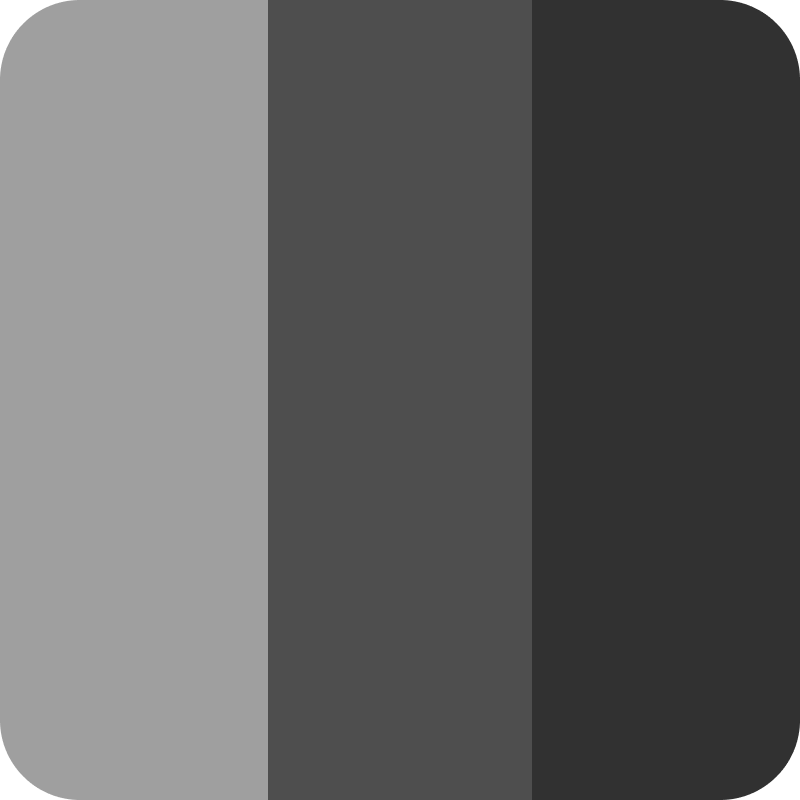

<!-- markdownlint-disable MD033 MD041 -->

# Presenter

<p align="center">
  
</p>

Aplicativo de apresentação de PDFs para desktop, construído com **Tauri 2** + **React** + **TypeScript**. Transforma um arquivo PDF em uma apresentação estilo PowerPoint, com uma janela de controle para o apresentador e janelas de projeção em tela cheia para o público.

## Recursos

- **Abertura de PDF** — selecione qualquer arquivo `.pdf` do computador, arraste e solte na tela inicial ou use o atalho `O`.
- **Histórico de arquivos** — sidebar na tela inicial exibe os últimos PDFs abertos; clique para reabrir (com verificação de existência e dialog de erro se o arquivo não for encontrado).
- **Renderização em alta resolução** — cada página é desenhada em `<canvas>` via PDF.js (react-pdf), redimensionando-se automaticamente ao tamanho da janela.
- **Modo apresentador multi-janela** — a janela principal controla janelas `viewscreen-{idx}` exibidas em tela cheia nos monitores selecionados.
- **Modo tela cheia com monitor único** — quando há apenas um monitor, a janela principal entra em tela cheia com controles flutuantes.
- **Seleção multi-monitor** — marque múltiplos monitores para exibir a apresentação simultaneamente em várias telas (configuração persistida em disco).
- **Pré-carregamento** — as páginas anterior e posterior à atual são carregadas em segundo plano para transições instantâneas.
- **Preview do próximo slide** — miniatura da próxima página na sidebar direita, com tamanho redimensionável via arraste do mouse.
- **Carrossel de slides** — filmstrip na parte inferior com miniaturas de todas as páginas e anotações; clique para pular para qualquer slide; altura ajustável via arraste.
- **Zoom** — Ctrl+Scroll ou Ctrl+/Ctrl−/Ctrl0 para ampliar/reduzir; Space+arraste para pan quando ampliado.
- **Cronômetro** — modo progressivo (stopwatch) ou regressivo (countdown) para controle de tempo.
- **Tela preta** — oculta temporariamente o conteúdo do projetor (pausa visual).
- **Exportar PDF** — gere uma cópia do documento com todas as anotações incorporadas.
- **Anotações ao vivo** — desenhe sobre os slides durante a apresentação com ferramentas sincronizadas em tempo real com o projetor:
  - **Caneta** — traço contínuo em vermelho (espessura ajustável via scroll do mouse).
  - **Marcador de texto** — destaque semi-transparente em amarelo (espessura ajustável via scroll).
  - **Laser** — ponteiro luminoso vermelho para chamar atenção.
  - **Borracha** — apague apenas os traços selecionados arrastando sobre eles (raio ajustável via scroll; duplo-clique apaga tudo na página).
  - **Desfazer / Refazer** — Ctrl+Z / Ctrl+Shift+Z para desfazer e refazer anotações (até 50 passos).
  - **Linhas retas** — segure Shift durante o arraste para travar o traço em ângulos de 45° (caneta e marcador).
- **Botão de reset de tamanhos** — restaura os tamanhos padrão das ferramentas de anotação.
- **Confirmação ao fechar** — impede fechamento acidental quando há PDF ou apresentação ativa.

## Atalhos de teclado

| Tecla | Ação |
| --- | --- |
| `F5` | Iniciar / Encerrar apresentação |
| `O` | Abrir PDF (tela inicial) |
| `→` / `Espaço` / `Page Down` | Próximo slide |
| `←` / `Page Up` | Slide anterior |
| `Home` | Primeiro slide |
| `End` | Último slide |
| `B` | Alternar tela preta |
| `Esc` | Encerrar apresentação ou voltar ao início (com confirmação) |
| `L` | Ativar/desativar laser |
| `P` | Ativar/desativar caneta |
| `H` | Ativar/desativar marcador de texto |
| `E` | Ativar/desativar borracha |
| `Ctrl+Z` | Desfazer última anotação |
| `Ctrl+Shift+Z` / `Ctrl+Y` | Refazer anotação |
| `Ctrl+=` / `Ctrl+-` | Zoom in / out |
| `Ctrl+0` | Resetar zoom |
| `Space+arraste` | Pan (quando zoom > 1) |
| `Scroll do mouse` (com ferramenta ativa) | Aumentar/diminuir tamanho da caneta, marcador ou borracha |
| `Duplo-clique` (com borracha) | Apagar todas as anotações do slide atual |

## Stack

- [Tauri 2](https://tauri.app/) — shell desktop (Rust)
- [React 19](https://react.dev/) + [TypeScript](https://www.typescriptlang.org/)
- [Vite](https://vite.dev/) — bundler
- [Tailwind CSS 4](https://tailwindcss.com/) + [shadcn/ui](https://ui.shadcn.com/) (Radix UI)
- [react-pdf](https://github.com/wojtekmaj/react-pdf) — renderização de PDF (PDF.js)
- [Lucide](https://lucide.dev/) — ícones

## Arquitetura

- `src/` — frontend React/TypeScript
  - `src/state/presentation.tsx` — estado global (Context), navegação de slides, seleção multi-monitor, zoom
  - `src/state/annotations/` — estado de anotações (provider + contexto compartilhado)
    - `presenter.tsx` — hook principal do apresentador (strokes, undo/redo, emit de eventos)
    - `viewscreen.ts` — hook read-only da janela de projeção (escuta eventos)
    - `index.ts` — barrel re-export
  - `src/components/` — UI
    - `Sidebar.tsx` — orquestrador da sidebar (decompõe nos sub-componentes abaixo)
    - `sidebar/FileControls.tsx` — abertura de PDF, nome do documento, voltar ao início
    - `sidebar/MonitorSelector.tsx` — seleção multi-monitor com checkboxes
    - `sidebar/PresentationControls.tsx` — iniciar/encerrar apresentação, tela preta
    - `sidebar/SlideNavigation.tsx` — navegação prev/next e input de página
    - `sidebar/AnnotationToolbar.tsx` — botões de ferramentas com tamanhos + undo/redo/reset
    - `PdfStage.tsx` — renderizador de página com zoom (CSS transform) e pan (Space+drag)
    - `AnnotationLayer.tsx` — canvas de anotações (caneta, marcador, laser, borracha)
    - `AnnotationLayerContainer.tsx` — wrapper que conecta AnnotationLayer ao contexto
    - `FloatingControls.tsx` — controles flutuantes no modo tela cheia (navegação + ferramentas)
    - `PreviewPanel.tsx` — sidebar direita com preview do próximo slide + exportação + configurações
    - `SlideCarousel.tsx` — filmstrip de miniaturas com anotações e altura ajustável
    - `NextPreview.tsx` — preview do próximo slide
    - `Timer.tsx` — cronômetro progressivo/regressivo
    - `Welcome.tsx` — tela inicial com drag-and-drop e atalhos
    - `WelcomeSidebar.tsx` — sidebar de histórico de arquivos recentes
  - `src/viewscreen/` — janela de projeção (instância secundária)
  - `src/hooks/` — hooks customizados
    - `useKeyboardShortcuts.ts` — atalhos de teclado globais
    - `useAutoHide.ts` — auto-hide para controles flutuantes
  - `src/lib/` — helpers
    - `pdf.ts` — leitura de PDF e comandos Rust (read_pdf, set_document, get_document, file_exists)
    - `monitors.ts` — detecção de monitores, config persistida e comandos de projeção
    - `annotations.ts` — tipos, constantes e utilidades de anotações (distâncias, eraser logic)
    - `canvasDrawing.ts` — funções de desenho compartilhadas (drawStrokes, drawLaser, drawEraserCursor, drawToolCursor)
    - `exportPdf.ts` — exportação de PDF com anotações incorporadas
    - `fileHistory.ts` — histórico de arquivos abertos (localStorage)
    - `shared.ts` — constantes de eventos e interfaces compartilhadas
- `src-tauri/` — backend Rust
  - `src/lib.rs` — comandos (`read_pdf`, `file_exists`, `set_document`, `get_document`, `list_monitors`, `open_projections`, `close_projection`, `save_file`, etc.) e ícone embutido
  - `capabilities/default.json` — permissões das janelas
  - `tauri.conf.json` — configuração do app e janelas

A sincronização entre janelas usa os eventos globais do Tauri: `mudar-slide` (troca de página), `tela-preta` (blackout), `anotacao-sincronizar` (undo/redo), `anotacao-limpar-pagina` (borracha duplo-clique) e eventos de anotações (`anotacao-traco`, `anotacao-laser`, `anotacao-apagar`, `anotacao-limpar`). As janelas de projeção são criadas/posicionadas/fechadas por comandos Rust (`open_projections` / `close_projection`), que as movem para os monitores escolhidos e ativam o modo tela cheia.

## Como executar

### Pré-requisitos

- [Node.js](https://nodejs.org/) (v18+ recomendado) e npm
- [Rust](https://www.rust-lang.org/tools/install) (toolchain stable)
- Plataforma de build do Tauri — no Windows, o [Visual Studio Build Tools](https://visualstudio.microsoft.com/pt-br/visual-cpp-build-tools/) com a carga de trabalho "Desenvolvimento para desktop com C++" e o [WebView2 Runtime](https://developer.microsoft.com/microsoft-edge/webview2/) (normalmente já presente no Windows 10/11).

### Passos

1. **Clone e instale as dependências**

   ```sh
   npm install
   ```

2. **Execute em modo desenvolvimento**

   ```sh
   npm run tauri dev
   ```

   Isso inicia o Vite (frontend em `http://localhost:1420`) e abre a janela do app com recarregamento automático.

3. **Gere o instalador de produção**

   ```sh
   npm run tauri build
   ```

    Os artefatos são gerados em `src-tauri/target/release/bundle/` (`.exe` NSIS no Windows). O installador NSIS usa um ícone personalizado configurado em `tauri.conf.json`.

### Uso

1. Clique em **Abrir PDF** e selecione o arquivo da apresentação.
2. (Opcional) Na seção **Tela de projeção**, marque os monitores onde a apresentação será exibida.
3. Clique em **Iniciar (F5)** — as janelas de projeção abrem em tela cheia nos monitores selecionados.
4. Navegue com as setas, `Espaço` ou pelos controles da sidebar.
5. Use as ferramentas de anotação (caneta, marcador, laser, borracha) na barra inferior da sidebar.
6. Use `B` para tela preta e `F5`/`Esc` para encerrar.

## CI/CD

O projeto possui workflows automatizados no GitHub Actions:

- **`build-windows.yml`** — gera o instalador NSIS (`.exe`) no `windows-latest`
- **`build-linux.yml`** — gera pacotes `.deb` e `.AppImage` no `ubuntu-24.04`
- **`build-macos.yml`** — gera o instalador `.dmg` no `macos-latest` (ARM64)
- **`release.yml`** — disparado por tags `v*`, builda para todas as plataformas e cria um draft de release no GitHub com os artefatos

Todos os workflows rodam a cada push na branch `main` e podem ser disparados manualmente (`workflow_dispatch`).
